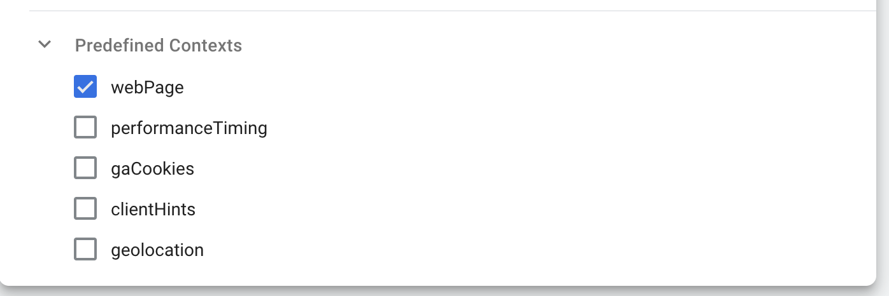

While the tracking setup provides event data on user actions at a specific point in time, context describes the setting in which an event takes place. To describe the context of an event, we need to define and capture individual entities. For example:

- The user performing an action
- The web page the action occurred on
- A product that has been interacted with

Together, these entities make up the context of an event.

Similar to the predefined events, a number of entities are available to implement out of the box including:

- **webPage Entity** - Adds the Pageview ID
- **session Entity** - Information about the user session
- **performanceTiming Entity** - Calculate page performance metrics
- **geolocation Entity** - Information on the users location

## Enable predefined entities

The `webPage` entity is enabled by default in the JavaScript tracker. This is **required** for modeling your data using the `snowplow-unified` dbt package.

### JavaScript

Enable the context by including the context options below in your tracker creation:

```javascript
window.snowplow('newTracker', 'sp', '{{Url for Collector}}', {
  ...
  contexts: {
        webPage: true,
      }
  ...
});
```

Each event sent with this tracker will now contain the data from each of these entities.

### React

Enable the context by including the context options below in your tracker creation:

```javascript
let tracker = newTracker('sp', '{{Url for Collector}}', {
  ...
  contexts: {
    webPage: true
  }
  ...
});
```

Each event sent with this tracker will now contain the data from each of these entities.

### Angular

Enable the context by including the context options below in your tracker creation:

```javascript
export class SnowplowService {
  tracker: BrowserTracker = newTracker('sp', '{{Url for Collector}}', {
  ...
  contexts: {
      webPage: true,
      session: false
      }
  ...
  }
});
```

Each event sent with this tracker will now contain the data from each of these entities.

### Google Tag Manager

The `webPage` entity is enabled by default in GTM. This is **required** for modeling your data using the `snowplow-unified` dbt package.

Enable the context by including the context options below in your variable template editor, under predefined contexts.



Each event sent with this tracker will now contain the data from each of these entities.
