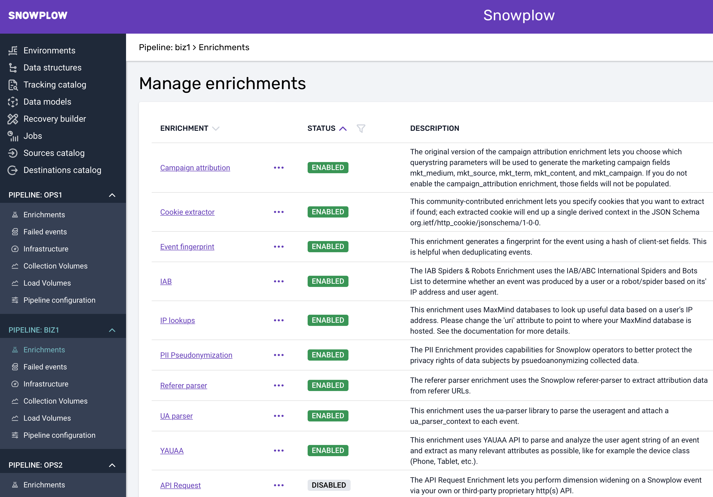

Snowplow offers a large number of enrichments that can be used to enhance your event data. An enrichment either updates or populates fields of the atomic event or adds a self-describing context to derived_contexts.

For this project, we'll enable the IAB, UA parser and YAUAA enrichments in your console:

**IAB** - Use the IAB/ABC International Spiders and Bots List to determine whether an event was produced by a user or a robot/spider based on its IP address and user agent.

**UA Parser** - Parse the useragent and attach detailed useragent information to each event.

**YAUAA** - Parse and analyze the user agent string of an event and extract as many relevant attributes as possible using YAUAA API.

Note: The IAB enrichment requires purchase (included with Snowplow BDP).

## BDP Cloud

For BDP Cloud users adding enrichments is fairly straightforward: Simply click on **Enabled/Disabled** to change the status of the enrichment for your pipeline under **Enrichments**:



## Open Source

For Open Source users adding enrichments can be achieved by adding the following JSON files to their enrichment configuration:

### IAB

`iab_spiders_and_robots_enrichment.json`:

```json
{
  "schema": "iglu:com.snowplowanalytics.snowplow.enrichments/iab_spiders_and_robots_enrichment/jsonschema/1-0-0",
  "data": {
    "name": "iab_spiders_and_robots_enrichment",
    "vendor": "com.snowplowanalytics.snowplow.enrichments",
    "enabled": true,
    "parameters": {
      "ipFile": {
        "database": "ip_exclude_current_cidr.txt",
        "uri": "s3://snowplow-hosted-assets-proprietary-eu-west-1/third-party/com.iab"
      },
      "excludeUseragentFile": {
        "database": "exclude_current.txt",
        "uri": "s3://snowplow-hosted-assets-proprietary-eu-west-1/third-party/com.iab"
      },
      "includeUseragentFile": {
        "database": "include_current.txt",
        "uri": "s3://snowplow-hosted-assets-proprietary-eu-west-1/third-party/com.iab"
      }
    }
  }
}
```

### UA Parser

`ua_parser_config.json`:

```json
{
  "schema": "iglu:com.snowplowanalytics.snowplow/ua_parser_config/jsonschema/1-0-1",
  "data": {
    "vendor": "com.snowplowanalytics.snowplow",
    "name": "ua_parser_config",
    "enabled": true,
    "parameters": {
      "database": "regexes-latest.yaml",
      "uri": "s3://snowplow-hosted-assets/third-party/ua-parser/"
    }
  }
}
```

### YAUAA

`yauaa_enrichment_config.json`:

```json
{
  "schema": "iglu:com.snowplowanalytics.snowplow.enrichments/yauaa_enrichment_config/jsonschema/1-0-0",
  "data": {
    "enabled": true,
    "vendor": "com.snowplowanalytics.snowplow.enrichments",
    "name": "yauaa_enrichment_config"
  }
}
```
