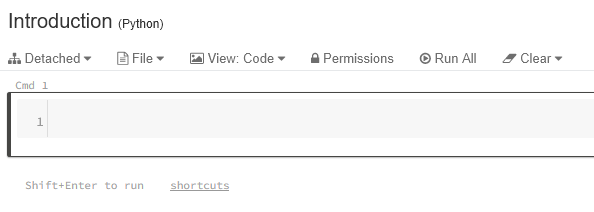

You can create custom visualizations including dashboards using a Databricks notebook. This section will guide you through setting up and running a Databricks notebook to visualize your Snowplow web data.

## Clone repository

Download the databricks notebook file from our repo to get started:

```bash
git clone --depth 1  --filter=blob:none --sparse https://github.com/snowplow-incubator/snowplow-accelerator-resources.git ; 
cd snowplow-accelerator-resources
git sparse-checkout set advanced-analytics-web-accelerator/databricks-notebook
```

## Import the notebook

Go to your Databricks **Workspace** and click on the Down Arrowhead sign then select **Import**. Browse to the downloaded `snowplow_advanced_analytics_for_web.ipynb` notebook and click **Import**.


For further information on this, check out the official Databricks [documentation](https://docs.databricks.com/notebooks/notebooks-manage.html).

## Attach the notebook to your cluster

Before you can do any work, you must first attach the notebook to a cluster.

To attach a notebook to a cluster:

1. In the notebook toolbar, click **Detached**



2. From the drop-down, select a cluster

## Change source table schemas and variables

The predefined SQL statements all refer to the `derived` schema and use table names from the deprecated snowplow-web package. Make sure to update both the schema name and table names before running the notebook:

1. **Schema**: Change from `derived` to `[your_dbt_schema]_derived`
2. **Table names**: Update table references from:
   - `snowplow_web_page_views` → `snowplow_unified_views`
   - `snowplow_web_sessions` → `snowplow_unified_sessions`
   - `snowplow_web_users` → `snowplow_unified_users`

You can do this quickly by using the **Edit / Find and replace** functionality.

## Run the notebook

Click on **Run all** which you can find in the toolbar at the top of the page. It should take a minute or so to have everything refreshed. Once finished you can go to **View** and click on **Results only** to see the outcome without the code snippets.

## Check out the dashboard

Head over to **Views/web_accelerator** under dashboards to open the corresponding dashboard as well.
