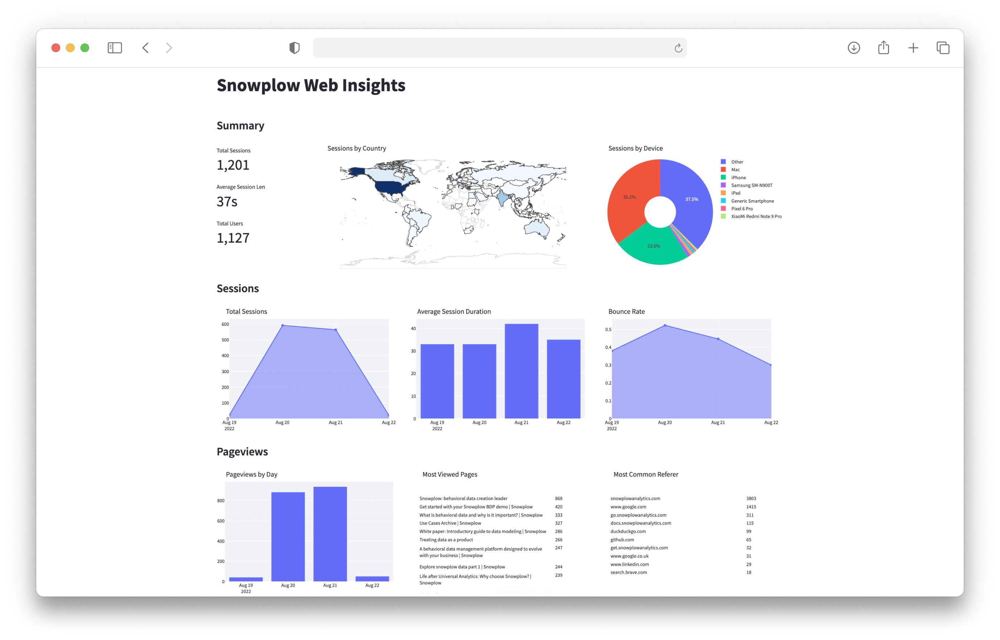

Welcome to the **analytics for web** tutorial. Once finished, you will be able to build a deeper understanding of customer behavior on your website and use your data to influence business decisions.

Here you will learn to model and visualize Snowplow data using the [snowplow-unified](https://hub.getdbt.com/snowplow/snowplow_unified/latest/) dbt package and Streamlit, set up Snowplow tracking and enrichment, and apply what you have learned on your own pipeline to gain insights.

## Who this tutorial is for

This tutorial is designed for data practitioners who would like to get familiar with Snowplow data, and those who want to learn how to use the snowplow-unified dbt package and set up tracking using their company's website or single page application to gain insight from their customers' behavioral data as quickly as possible.

## What you will learn

In approximately 8 working hours you can achieve the following:

- **Upload data** - Upload a sample Snowplow events dataset to your warehouse
- **Model** - Configure and run the snowplow-unified data model
- **Visualize** - Visualize the modeled data with Streamlit or Databricks notebook
- **Track** - Set up and deploy tracking to your website or single page application
- **Enrich** - Add enrichments to your data
- **Next steps** - Gain value from your own pipeline data through modeling and visualization

## Architecture

## Prerequisites

**Modeling and Visualization**
- [dbt CLI](https://docs.getdbt.com/docs/core/installation) installed or [dbt Cloud](https://docs.getdbt.com/docs/cloud/about-cloud-setup) account available
- New dbt [project](https://docs.getdbt.com/docs/build/projects) created and configured
- Python 3 installed
- Snowflake, Databricks, or BigQuery account and a user with access to create schemas and tables

**Tracking and Enrichment**
- Snowplow pipeline
- Web app to implement tracking

Please note that Snowflake, Databricks, or BigQuery will be used for illustration but the snowplow-unified dbt package also supports Postgres and Redshift.

## What you will build

By the end of this tutorial, you will have built an Advanced Analytics for Web Dashboard using either Streamlit or Databricks, giving you deeper insights into your web data.
