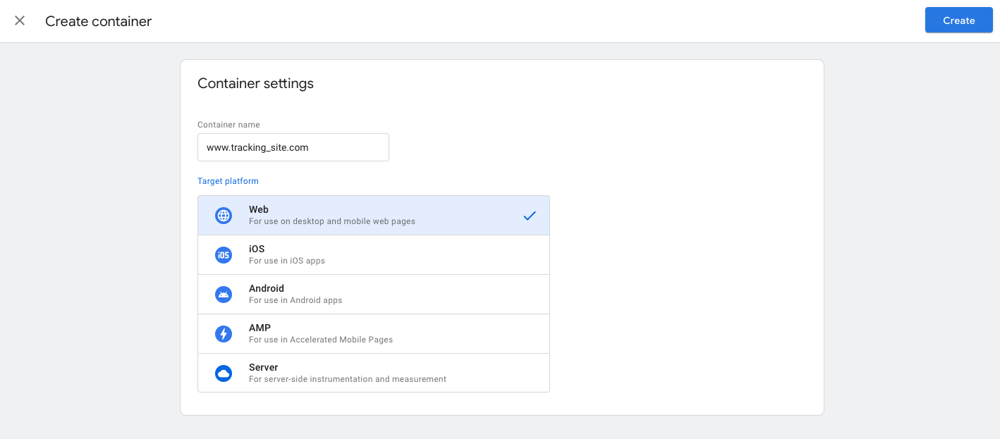
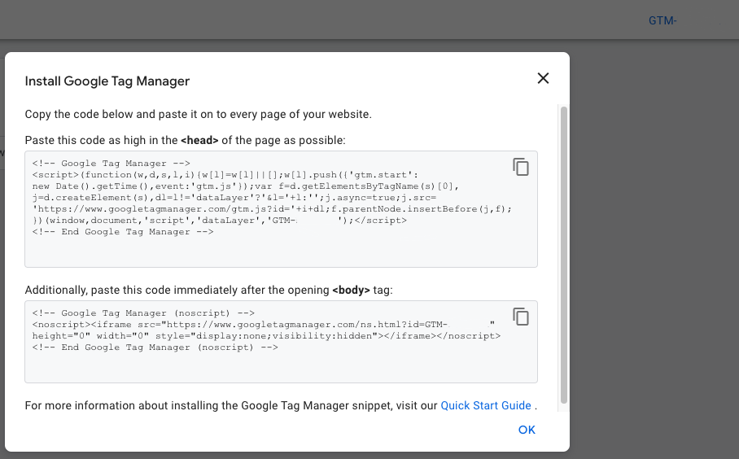
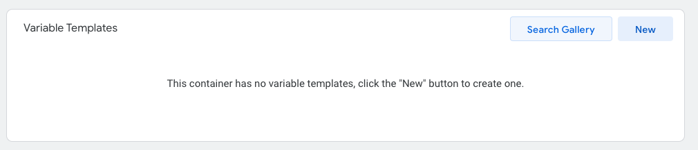
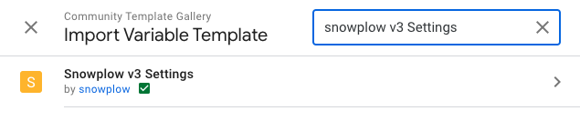
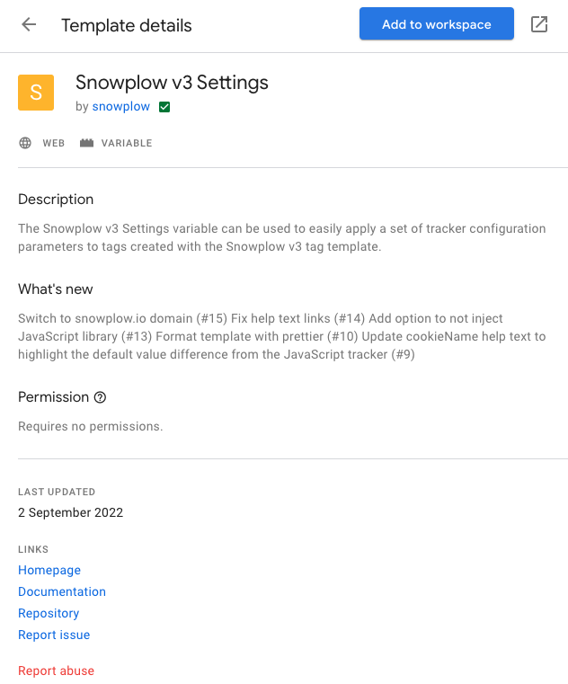
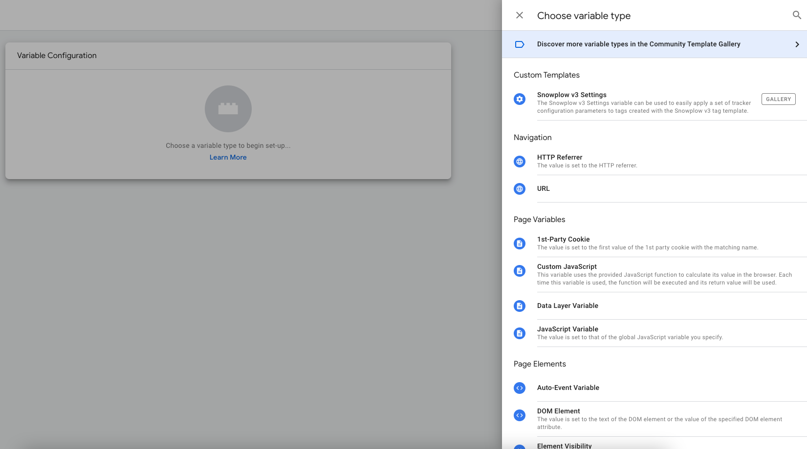
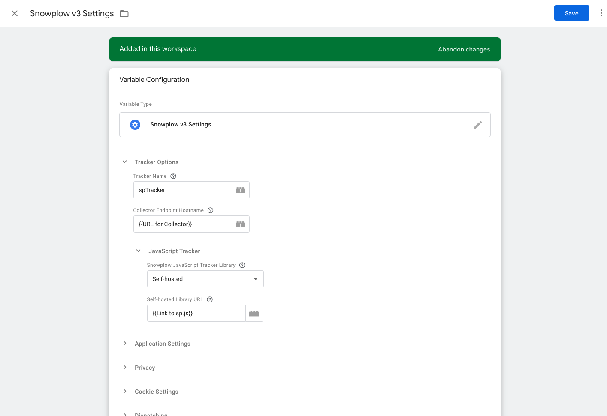
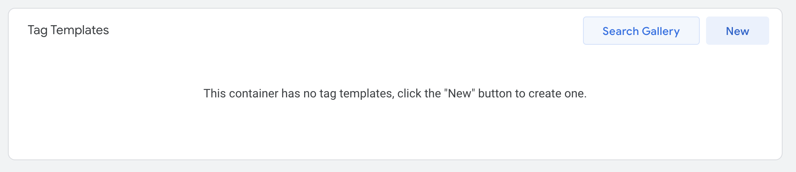
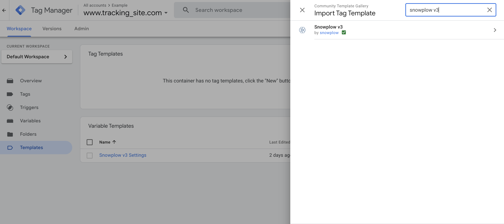
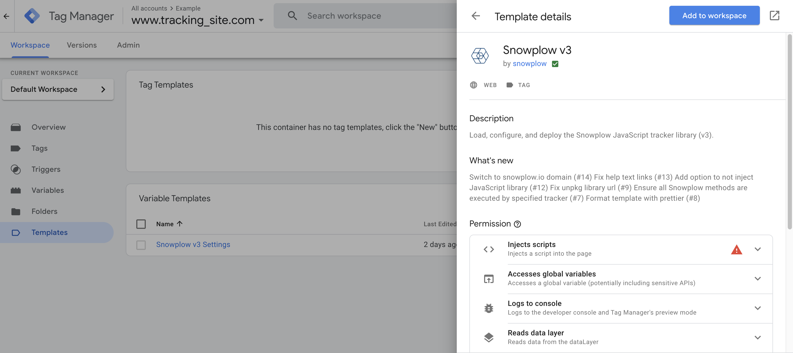

Getting started with sending events using the JavaScript tracker is very similar to other web analytics vendors like Google Analytics and Adobe Analytics. Once set up, you will have the ability to send behavioral data to your Snowplow pipeline.

There are a number of options to implement Snowplow tracking in your website or single page application. Select the required pathway to implement tracking on your project.

## JavaScript

### Download sp.js

Add the sp.js file to your project directory. The latest version can be found [here](https://github.com/snowplow/snowplow-javascript-tracker/releases).

### Add JS snippet

Add the snippet below to all of the pages you would like to track. Make sure to update the `{{Link to the sp.js file}}` variable.

Place the `<script>` tag into the `<head>` element of your page.

```html
<script type="text/javascript" async=1 >
;(function (p, l, o, w, i, n, g) { if (!p[i]) { p.GlobalSnowplowNamespace = p.GlobalSnowplowNamespace || []; p.GlobalSnowplowNamespace.push(i); p[i] = function () { (p[i].q = p[i].q || []).push(arguments) }; p[i].q = p[i].q || []; n = l.createElement(o); g = l.getElementsByTagName(o)[0]; n.async = 1; n.src = w; g.parentNode.insertBefore(n, g) } }(window, document, "script", "{{Link to sp.js file}}", "snowplow"));
</script>
```

### Configure the tracker

Call `newTracker` in the `<script>` tag, with the following arguments. This creates an instance of a basic tracker without any additional context.

- Tracker Name: `'sp'`
- Collector Url: `'{{Url for Collector}}'`

```javascript
window.snowplow('newTracker', 'sp', '{{Url for Collector}}')
```

In addition to the basic tracker, add the optional arguments below to the tracker to make use of some of Snowplow's more advanced features:

- `appId`: Identify events that occur on different applications
- `platform`: Identify the platform the event occurred on, in this case `web`
- `cookieSameSite`: Protects cookies from being accessed by third party domains

```javascript
window.snowplow('newTracker', 'sp', '{{Url for Collector}}', {
    appId: 'appId',
    platform: 'web',
    cookieSameSite: 'Lax',
});
```

## React

Note: `react-router-dom` is required to implement tracking in a react app.

### Install browser-tracker package

Install the `@snowplow/browser-tracker` via npm by running:

```bash
npm install @snowplow/browser-tracker
```

### Import the tracker package

In your `src` folder, create a file called `tracker.js`.

Import the browser tracker into `tracker.js` with the snippet below:

```javascript
import React from 'react';
import { newTracker, trackPageView, enableActivityTracking } from "@snowplow/browser-tracker";
```

### Configure the tracker

Create the tracker in `tracker.js` with the following arguments. This creates an instance of a basic tracker without any additional context.

- Tracker Name: `'sp'`
- Collector Url: `'{{Url for Collector}}'`

```javascript
let tracker = newTracker('sp', '{{Url for Collector}}')
```

In addition to the basic tracker, add the optional arguments below to the tracker to make use of some of Snowplow's more advanced features:

- `appId`: Identify events that occur on different applications
- `platform`: Identify the platform the event occurred on, in this case `web`
- `cookieSameSite`: Protects cookies from being accessed by third party domains

```javascript
let tracker = newTracker('sp', '{{Url for Collector}}', {
    appId: 'appId',
    platform: 'web',
    cookieSameSite: 'Lax',
});
```

## Angular

### Install browser-tracker package

Install the `@snowplow/browser-tracker` via npm by running:

```bash
npm install @snowplow/browser-tracker
```

### Generate Snowplow service

Run `ng generate service snowplow` to create `snowplow.service.ts` and `snowplow.service.spec.ts` within `src/app`.

Import the browser tracker to `snowplow.service.ts` by adding the snippet below:

```javascript
import { newTracker, trackPageView, enableActivityTracking, BrowserTracker } from "@snowplow/browser-tracker";
```

### Configure the tracker

Create the tracker with the following arguments. This creates an instance of a basic tracker without any additional context.

- Tracker Name: `'sp'`
- Collector Url: `'{{Url for Collector}}'`

Add the snippet below to `snowplow.service.ts`:

```javascript
export class SnowplowService {
  tracker: BrowserTracker = newTracker('sp', '{{Url for Collector}}')
}
```

In addition to the basic tracker, add the optional arguments below to the tracker to make use of some of Snowplow's more advanced features:

- `appId`: Identify events that occur on different applications
- `platform`: Identify the platform the event occurred on, in this case `web`
- `cookieSameSite`: Protects cookies from being accessed by third party domains

```javascript
export class SnowplowService {
  tracker: BrowserTracker = newTracker('sp',  '{{Url for Collector}}', {
    appId: 'appId',
    platform: 'web',
    cookieSameSite: 'Lax',
  })
}
```

## Google Tag Manager

Note: A Google Tag Manager Account is required for this pathway.

### Create container

Create a web container for your site.



### Add Tags to site

Install Google Tag Manager on your site by following the [installation guide](https://support.google.com/tagmanager/answer/6103696?hl=en#install) in the Install Tag Manager Box.

Tip: Near the top of the window, find your container ID, formatted as "GTM-XXXXXX". Click your container ID to launch the Install Tag Manager box.



### Add New Template Variable

Go to **Templates** and click **Search Gallery** under **Variable Templates**.



Search `Snowplow V3 Settings` in the search bar.



Add the template to your workspace.



Navigate to Variables, click new and select `Snowplow v3 Settings`.



Add your collector endpoint and link to your `sp.js` file.



### Add New Tag Template

Go to **Templates** and click **Search Gallery** under **Tag Templates**.



Search `Snowplow V3` in the search bar.



Add the template to your workspace.


