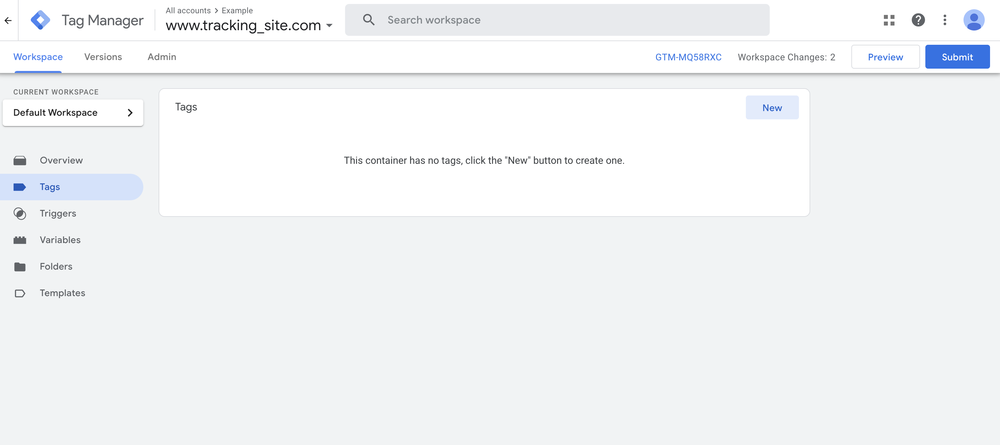
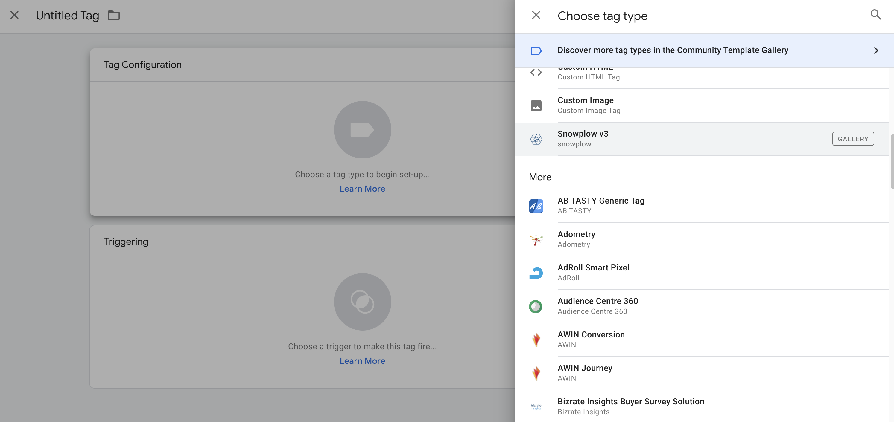
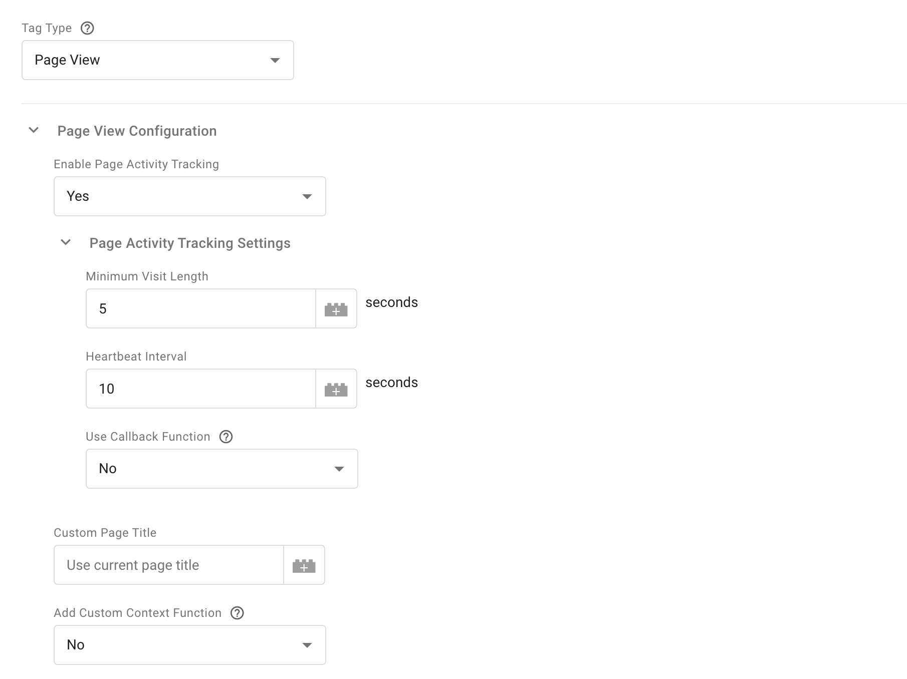
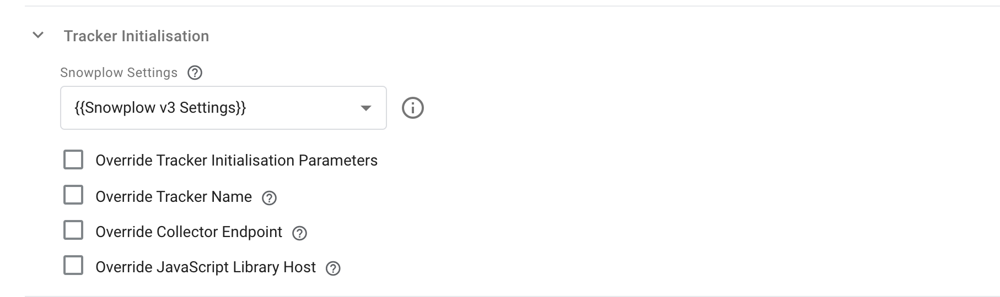
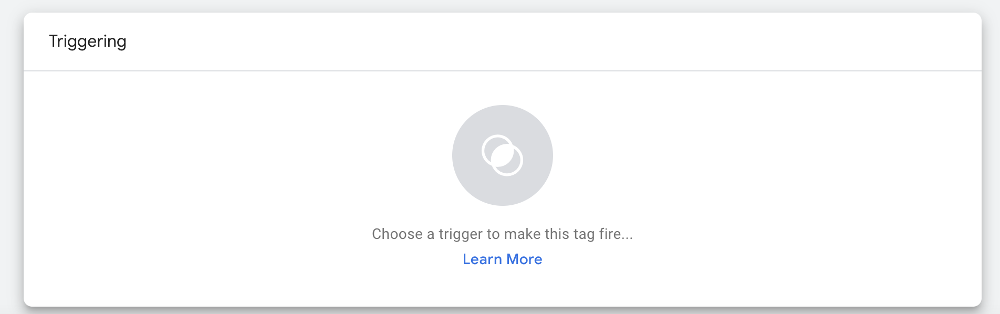
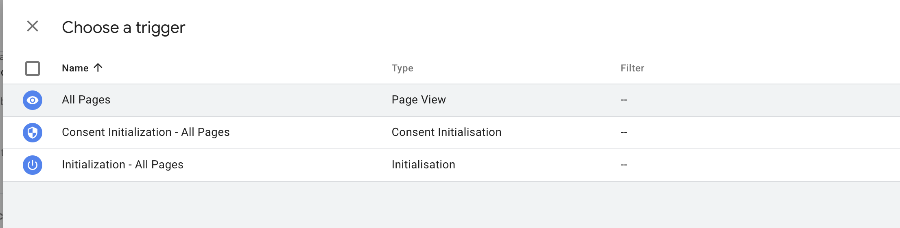
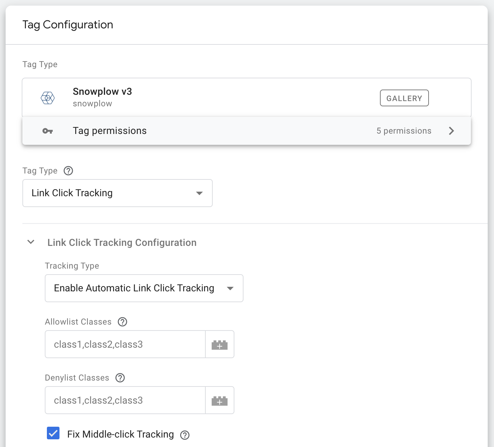

The trackers create data on user actions at a specific point in time. For example:

- Loading a web page
- Clicking a link
- Submitting a form

A number of tracking events are available out of the box. These include, but aren't limited to:

- Page views
- Heartbeats (Page Pings)
- Link clicks
- HTML form actions

## Pageviews and Page Pings

In this section, we will implement page views and page pings.

### JavaScript

#### Enable Activity Tracking

First we will enable activity tracking to collect page ping events. This will allow us to monitor engagement and record how a user digests content on the page over time.

- `minimumVisitLength`: The number of seconds from page load before the first page ping occurs
- `heartbeatDelay`: The number of seconds between page pings

Add the snippet to your `<script>` tag below the tracker instance:

```javascript
snowplow('enableActivityTracking', {
  minimumVisitLength: 5,
  heartbeatDelay: 10
});
```

#### Track Page View

To track a page view, simply call `trackPageView`:

```javascript
snowplow('trackPageView')
```

Note: `trackPageView` should go after the page ping event in step 1.

### React

#### Enable Activity Tracking

First we will enable activity tracking to collect page ping events. This will allow us to monitor engagement and record how a user digests content on the page over time.

- `minimumVisitLength`: The number of seconds from page load before the first page ping occurs
- `heartbeatDelay`: The number of seconds between page pings

Add the snippet to your `tracker.js` file below the tracker instance:

```javascript
enableActivityTracking({
  minimumVisitLength: 5,
  heartbeatDelay: 10,
});
```

#### Enable Pageview Tracking

To track page views, we will first define a function called `useLocationChange()`. This will take advantage of `useEffect`, the `useLocation` hook from `react-router-dom` and the `trackPageView` function from `browser-tracker`.

- `useLocation()`: returns an object, `location`, describing the current page
- `useEffect`: Executes a function whenever `location` changes. In this case `trackPageView()`
- `trackPageView()`: Sends a Snowplow page view event to the collector URL

Add the snippet below to `tracker.js`:

```javascript
const useLocationChange = () => {
  const location = useLocation();
  React.useEffect(() => {
    trackPageView();
   }, [location]);
};

export { tracker, useLocationChange };
```

#### Add Tracking to App

Import `useLocationChange` to your `App.js` file:

```javascript
import { useLocationChange } from './tracker';
```

Add the `useLocationChange()` method to your `App()` function in `App.js`:

```javascript
function App() {
  useLocationChange();
...
}

export default App;
```

### Angular

#### Enable Activity Tracking

First we will enable activity tracking to collect page ping events. This will allow us to monitor engagement and record how a user digests content on the page over time.

- `minimumVisitLength`: The number of seconds from page load before the first page ping occurs
- `heartbeatDelay`: The number of seconds between page pings

Add the snippet to your `snowplow.service.ts` in the `SnowplowService class` below the tracker configuration:

```javascript
constructor() {
    enableActivityTracking({
      minimumVisitLength: 5,
      heartbeatDelay: 10,
    });
  }
```

#### Track Page View

To track a page view, we will create a `trackPageView()` function which will make use of the built in Snowplow method.

Add the snippet to your `snowplow.service.ts` file below the constructor:

```javascript
public trackPageView(): void {
    trackPageView()
}
```

#### Import Snowplow Service

Add the snippet below to `app.component.ts`:

```javascript
import { Router, NavigationEnd } from '@angular/router';
import { SnowplowService } from './snowplow.service';
```

Add the constructor to the `AppComponent` class in `app.component.ts`. This contains the call to `trackPageView()`:

```javascript
constructor(router: Router, snowplow: SnowplowService) {
  router.events.subscribe((evt) => {
      if (evt instanceof NavigationEnd) {
        snowplow.trackPageView();
      }
  });
}
```

### Google Tag Manager

#### Create New Tag

Select **Tags** from the sidebar and click **New** to add a new tag to the workspace.



Import the Snowplow tag template.



#### Configure Pageview and Page Pings

Select the **Page View** option under **Tag Type**, and add the settings below to enable **Page Pings** as well as **Page Views**.



Add the variable template settings to your tracker configuration.



#### Configure Trigger

Add a new trigger to the tag.



Set trigger to **All Pages**.



## Optional Tracking

In addition to page pings and pageviews, you can enable link and form tracking. This won't be used in the model in later steps but can be used in your own analysis.

- **Link Tracking** - Captures the link's `href` by default as well as the `id`, `class` and `target` of the link
- **Form Tracking** - Tracks an event when a user focuses, changes or submits a form

### JavaScript

#### Link Click Tracking

To enable link click tracking, call the `enableLinkClickTracking` method:

```javascript
snowplow('enableLinkClickTracking');
```

You only need to call the method once to track all the links on a page.

#### HTML Form Tracking

To enable form tracking, simply call the `enableFormTracking` method:

```javascript
snowplow('enableFormTracking');
```

### React

#### Install Plugins

First install the plugins via npm:

```bash
npm install @snowplow/browser-plugin-link-click-tracking
npm install @snowplow/browser-plugin-form-tracking
```

#### Import Plugins

Next import the plugins to your `tracker.js` file:

```javascript
import { LinkClickTrackingPlugin, enableLinkClickTracking } from '@snowplow/browser-plugin-link-click-tracking';
import { FormTrackingPlugin, enableFormTracking } from '@snowplow/browser-plugin-form-tracking';
```

Add the two plugins to your tracker instance:

```javascript
let tracker = newTracker('sp', '{{Url for Collector}}', {
    plugins: [LinkClickTrackingPlugin(), FormTrackingPlugin()],
});
```

#### Enable Tracking

Add the `enableLinkClickTracking()` and `enableFormTracking()` methods to the `useEffect` hook in `tracker.js`:

```javascript
const useLocationChange = () => {
  const location = useLocation();
  React.useEffect(() => {
    enableLinkClickTracking() // Enable link click tracking here
    enableFormTracking() // Enable form tracking here
    trackPageView();
  }, [location]);
};
```

### Angular

#### Install Plugins

First install the plugins via npm:

```bash
npm install @snowplow/browser-plugin-link-click-tracking
npm install @snowplow/browser-plugin-form-tracking
```

#### Import Plugins

Next import the plugins to your `snowplow.service.ts` file:

```javascript
import { LinkClickTrackingPlugin, enableLinkClickTracking } from '@snowplow/browser-plugin-link-click-tracking';
import { FormTrackingPlugin, enableFormTracking } from '@snowplow/browser-plugin-form-tracking';
```

Add the two plugins to your tracker instance in `snowplow.service.ts`:

```javascript
tracker: BrowserTracker = newTracker('sp', '{{Url for Collector}}', {
    ...
    plugins: [LinkClickTrackingPlugin(), FormTrackingPlugin()],
    ...
  })
```

#### Enable Tracking

Add the `enableLinkClickTracking()` and `enableFormTracking()` methods to the `SnowplowService` class in `snowplow.service.ts`:

```javascript
public enableLinkClickTracking(): void { enableLinkClickTracking() }

public enableLFormTracking(): void { enableFormTracking() }
```

#### Add Tracking to App

Finally, add the `enableLinkClickTracking()` and `enableFormTracking()` methods to the constructor in the `AppComponent` class in `app.component.ts` as below:

```javascript
constructor(router: Router, snowplow: SnowplowService) {
    router.events.subscribe((evt) => {
      if (evt instanceof NavigationEnd) {
        snowplow.enableLinkClickTracking(); // Enable link click tracking here
        snowplow.enableFormTracking(); // Enable form tracking here
        snowplow.trackPageView();
      }
    });
  }
```

### Google Tag Manager

#### Create a New Tag

Add a new tag to the workspace.


Import the Snowplow tag template.


#### Configure Link Tracking/Form Tracking

Select the **Link Click Tracking** or **Form Tracking** option under **Tag Type**.



Add the variable template settings to your tracker configuration.


#### Configure Trigger

Add a new trigger to the tag.


Set trigger to **All Pages**.


