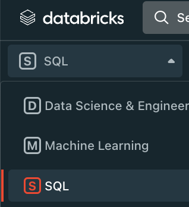

A sample events dataset for your warehouse has been provided. This will allow you to start data modeling and get familiar with Snowplow event data without needing a working pipeline. This section will guide you through uploading the sample data to your data warehouse.

There are different approaches for each supported warehouse. Select the option that matches your warehouse platform.

## Snowflake

We have provided a public S3 bucket where we store the sample data in CSV format:

URL: https://snowplow-demo-datasets.s3.eu-central-1.amazonaws.com/Web_Analytics/Web_Analytics_sample_events.csv

You will be able to load this file to your Snowflake warehouse with the following steps.

### Create the ATOMIC schema

If the ATOMIC schema doesn't exist, create it in your target database:

```sql
CREATE SCHEMA IF NOT EXISTS TARGET_DB.ATOMIC
```

### Create the SAMPLE_EVENTS_WEB_BASE table

This is where you will load the sample data. You will need to modify the TARGET_DB according to your own database:

```sql
CREATE OR REPLACE TABLE TARGET_DB.ATOMIC.SAMPLE_EVENTS_WEB_BASE (
    APP_ID VARCHAR(255),
    PLATFORM VARCHAR(255),
    ETL_TSTAMP TIMESTAMP_NTZ(9),
    COLLECTOR_TSTAMP TIMESTAMP_NTZ(9) NOT NULL,
    DVCE_CREATED_TSTAMP TIMESTAMP_NTZ(9),
    EVENT VARCHAR(128),
    EVENT_ID VARCHAR(36) NOT NULL,
    TXN_ID NUMBER(38,0),
    NAME_TRACKER VARCHAR(128),
    V_TRACKER VARCHAR(100),
    V_COLLECTOR VARCHAR(100),
    V_ETL VARCHAR(100),
    USER_ID VARCHAR(255),
    USER_IPADDRESS VARCHAR(128),
    USER_FINGERPRINT VARCHAR(128),
    DOMAIN_USERID VARCHAR(128),
    DOMAIN_SESSIONIDX NUMBER(38,0),
    NETWORK_USERID VARCHAR(128),
    GEO_COUNTRY VARCHAR(2),
    GEO_REGION VARCHAR(3),
    GEO_CITY VARCHAR(75),
    GEO_ZIPCODE VARCHAR(15),
    GEO_LATITUDE FLOAT,
    GEO_LONGITUDE FLOAT,
    GEO_REGION_NAME VARCHAR(100),
    IP_ISP VARCHAR(100),
    IP_ORGANIZATION VARCHAR(128),
    IP_DOMAIN VARCHAR(128),
    IP_NETSPEED VARCHAR(100),
    PAGE_URL VARCHAR(4096),
    PAGE_TITLE VARCHAR(2000),
    PAGE_REFERRER VARCHAR(4096),
    PAGE_URLSCHEME VARCHAR(16),
    PAGE_URLHOST VARCHAR(255),
    PAGE_URLPORT NUMBER(38,0),
    PAGE_URLPATH VARCHAR(3000),
    PAGE_URLQUERY VARCHAR(6000),
    PAGE_URLFRAGMENT VARCHAR(3000),
    REFR_URLSCHEME VARCHAR(16),
    REFR_URLHOST VARCHAR(255),
    REFR_URLPORT NUMBER(38,0),
    REFR_URLPATH VARCHAR(6000),
    REFR_URLQUERY VARCHAR(6000),
    REFR_URLFRAGMENT VARCHAR(3000),
    REFR_MEDIUM VARCHAR(25),
    REFR_SOURCE VARCHAR(50),
    REFR_TERM VARCHAR(255),
    MKT_MEDIUM VARCHAR(255),
    MKT_SOURCE VARCHAR(255),
    MKT_TERM VARCHAR(255),
    MKT_CONTENT VARCHAR(500),
    MKT_CAMPAIGN VARCHAR(255),
    SE_CATEGORY VARCHAR(1000),
    SE_ACTION VARCHAR(1000),
    SE_LABEL VARCHAR(4096),
    SE_PROPERTY VARCHAR(1000),
    SE_VALUE FLOAT,
    TR_ORDERID VARCHAR(255),
    TR_AFFILIATION VARCHAR(255),
    TR_TOTAL NUMBER(18,2),
    TR_TAX NUMBER(18,2),
    TR_SHIPPING NUMBER(18,2),
    TR_CITY VARCHAR(255),
    TR_STATE VARCHAR(255),
    TR_COUNTRY VARCHAR(255),
    TI_ORDERID VARCHAR(255),
    TI_SKU VARCHAR(255),
    TI_NAME VARCHAR(255),
    TI_CATEGORY VARCHAR(255),
    TI_PRICE NUMBER(18,2),
    TI_QUANTITY NUMBER(38,0),
    PP_XOFFSET_MIN NUMBER(38,0),
    PP_XOFFSET_MAX NUMBER(38,0),
    PP_YOFFSET_MIN NUMBER(38,0),
    PP_YOFFSET_MAX NUMBER(38,0),
    USERAGENT VARCHAR(1000),
    BR_NAME VARCHAR(50),
    BR_FAMILY VARCHAR(50),
    BR_VERSION VARCHAR(50),
    BR_TYPE VARCHAR(50),
    BR_RENDERENGINE VARCHAR(50),
    BR_LANG VARCHAR(255),
    BR_FEATURES_PDF BOOLEAN,
    BR_FEATURES_FLASH BOOLEAN,
    BR_FEATURES_JAVA BOOLEAN,
    BR_FEATURES_DIRECTOR BOOLEAN,
    BR_FEATURES_QUICKTIME BOOLEAN,
    BR_FEATURES_REALPLAYER BOOLEAN,
    BR_FEATURES_WINDOWSMEDIA BOOLEAN,
    BR_FEATURES_GEARS BOOLEAN,
    BR_FEATURES_SILVERLIGHT BOOLEAN,
    BR_COOKIES BOOLEAN,
    BR_COLORDEPTH VARCHAR(12),
    BR_VIEWWIDTH NUMBER(38,0),
    BR_VIEWHEIGHT NUMBER(38,0),
    OS_NAME VARCHAR(50),
    OS_FAMILY VARCHAR(50),
    OS_MANUFACTURER VARCHAR(50),
    OS_TIMEZONE VARCHAR(255),
    DVCE_TYPE VARCHAR(50),
    DVCE_ISMOBILE BOOLEAN,
    DVCE_SCREENWIDTH NUMBER(38,0),
    DVCE_SCREENHEIGHT NUMBER(38,0),
    DOC_CHARSET VARCHAR(128),
    DOC_WIDTH NUMBER(38,0),
    DOC_HEIGHT NUMBER(38,0),
    TR_CURRENCY VARCHAR(3),
    TR_TOTAL_BASE NUMBER(18,2),
    TR_TAX_BASE NUMBER(18,2),
    TR_SHIPPING_BASE NUMBER(18,2),
    TI_CURRENCY VARCHAR(3),
    TI_PRICE_BASE NUMBER(18,2),
    BASE_CURRENCY VARCHAR(3),
    GEO_TIMEZONE VARCHAR(64),
    MKT_CLICKID VARCHAR(128),
    MKT_NETWORK VARCHAR(64),
    ETL_TAGS VARCHAR(500),
    DVCE_SENT_TSTAMP TIMESTAMP_NTZ(9),
    REFR_DOMAIN_USERID VARCHAR(128),
    REFR_DVCE_TSTAMP TIMESTAMP_NTZ(9),
    DOMAIN_SESSIONID VARCHAR(128),
    DERIVED_TSTAMP TIMESTAMP_NTZ(9),
    EVENT_VENDOR VARCHAR(1000),
    EVENT_NAME VARCHAR(1000),
    EVENT_FORMAT VARCHAR(128),
    EVENT_VERSION VARCHAR(128),
    EVENT_FINGERPRINT VARCHAR(128),
    TRUE_TSTAMP TIMESTAMP_NTZ(9),
    LOAD_TSTAMP TIMESTAMP_NTZ(9),
    CONTEXTS_COM_SNOWPLOWANALYTICS_SNOWPLOW_UA_PARSER_CONTEXT_1 VARIANT,
    CONTEXTS_COM_SNOWPLOWANALYTICS_SNOWPLOW_WEB_PAGE_1 VARIANT,
    CONTEXTS_COM_IAB_SNOWPLOW_SPIDERS_AND_ROBOTS_1 VARIANT,
    CONTEXTS_NL_BASJES_YAUAA_CONTEXT_1 VARIANT,
    constraint EVENT_ID_PK primary key (EVENT_ID)
);
```

### Create stage

```sql
CREATE OR REPLACE STAGE snowplow_web_sample_stage
url = 's3://snowplow-demo-datasets/Web_Analytics/Web_Analytics_sample_events.csv'
file_format = (TYPE=csv field_delimiter=',' skip_header=1, FIELD_OPTIONALLY_ENCLOSED_BY='"')
```

### Copy into base table from stage

```sql
COPY INTO TARGET_DB.ATOMIC.SAMPLE_EVENTS_WEB_BASE
FROM @snowplow_web_sample_stage
```

### Create the ATOMIC.SAMPLE_EVENTS_WEB table

```sql
CREATE OR REPLACE TABLE TARGET_DB.ATOMIC.SAMPLE_EVENTS_WEB AS (
SELECT
    APP_ID,
    PLATFORM,
    ETL_TSTAMP,
    COLLECTOR_TSTAMP,
    DVCE_CREATED_TSTAMP,
    EVENT,
    EVENT_ID,
    TXN_ID,
    NAME_TRACKER,
    V_TRACKER,
    V_COLLECTOR,
    V_ETL,
    USER_ID,
    USER_IPADDRESS,
    USER_FINGERPRINT,
    DOMAIN_USERID,
    DOMAIN_SESSIONIDX,
    NETWORK_USERID,
    GEO_COUNTRY,
    GEO_REGION,
    GEO_CITY,
    GEO_ZIPCODE,
    GEO_LATITUDE,
    GEO_LONGITUDE,
    GEO_REGION_NAME,
    IP_ISP,
    IP_ORGANIZATION,
    IP_DOMAIN,
    IP_NETSPEED,
    PAGE_URL,
    PAGE_TITLE,
    PAGE_REFERRER,
    PAGE_URLSCHEME,
    PAGE_URLHOST,
    PAGE_URLPORT,
    PAGE_URLPATH,
    PAGE_URLQUERY,
    PAGE_URLFRAGMENT,
    REFR_URLSCHEME,
    REFR_URLHOST,
    REFR_URLPORT,
    REFR_URLPATH,
    REFR_URLQUERY,
    REFR_URLFRAGMENT,
    REFR_MEDIUM,
    REFR_SOURCE,
    REFR_TERM,
    MKT_MEDIUM,
    MKT_SOURCE,
    MKT_TERM,
    MKT_CONTENT,
    MKT_CAMPAIGN,
    SE_CATEGORY,
    SE_ACTION,
    SE_LABEL,
    SE_PROPERTY,
    SE_VALUE,
    TR_ORDERID,
    TR_AFFILIATION,
    TR_TOTAL,
    TR_TAX,
    TR_SHIPPING,
    TR_CITY,
    TR_STATE,
    TR_COUNTRY,
    TI_ORDERID,
    TI_SKU,
    TI_NAME,
    TI_CATEGORY,
    TI_PRICE,
    TI_QUANTITY,
    PP_XOFFSET_MIN,
    PP_XOFFSET_MAX,
    PP_YOFFSET_MIN,
    PP_YOFFSET_MAX,
    REPLACE(USERAGENT, '\"', '') as USERAGENT,
    BR_NAME,
    BR_FAMILY,
    BR_VERSION,
    BR_TYPE,
    BR_RENDERENGINE,
    BR_LANG,
    BR_FEATURES_PDF,
    BR_FEATURES_FLASH,
    BR_FEATURES_JAVA,
    BR_FEATURES_DIRECTOR,
    BR_FEATURES_QUICKTIME,
    BR_FEATURES_REALPLAYER,
    BR_FEATURES_WINDOWSMEDIA,
    BR_FEATURES_GEARS,
    BR_FEATURES_SILVERLIGHT,
    BR_COOKIES,
    BR_COLORDEPTH,
    BR_VIEWWIDTH,
    BR_VIEWHEIGHT,
    OS_NAME,
    OS_FAMILY,
    OS_MANUFACTURER,
    OS_TIMEZONE,
    DVCE_TYPE,
    DVCE_ISMOBILE,
    DVCE_SCREENWIDTH,
    DVCE_SCREENHEIGHT,
    DOC_CHARSET,
    DOC_WIDTH,
    DOC_HEIGHT,
    TR_CURRENCY,
    TR_TOTAL_BASE,
    TR_TAX_BASE,
    TR_SHIPPING_BASE,
    TI_CURRENCY,
    TI_PRICE_BASE,
    BASE_CURRENCY,
    GEO_TIMEZONE,
    MKT_CLICKID,
    MKT_NETWORK,
    ETL_TAGS,
    DVCE_SENT_TSTAMP,
    REFR_DOMAIN_USERID,
    REFR_DVCE_TSTAMP,
    DOMAIN_SESSIONID,
    DERIVED_TSTAMP,
    EVENT_VENDOR,
    EVENT_NAME,
    EVENT_FORMAT,
    EVENT_VERSION,
    EVENT_FINGERPRINT,
    TRUE_TSTAMP,
    LOAD_TSTAMP,
    PARSE_JSON(REPLACE(REPLACE(CONTEXTS_COM_SNOWPLOWANALYTICS_SNOWPLOW_UA_PARSER_CONTEXT_1,'\"', ''),'''','\"')) as CONTEXTS_COM_SNOWPLOWANALYTICS_SNOWPLOW_UA_PARSER_CONTEXT_1,
    PARSE_JSON(REPLACE(REPLACE(CONTEXTS_COM_SNOWPLOWANALYTICS_SNOWPLOW_WEB_PAGE_1,'\"', ''),'''','\"')) as CONTEXTS_COM_SNOWPLOWANALYTICS_SNOWPLOW_WEB_PAGE_1,
    PARSE_JSON(REPLACE(REPLACE(CONTEXTS_COM_IAB_SNOWPLOW_SPIDERS_AND_ROBOTS_1,'\"', ''),'''','\"')) as CONTEXTS_COM_IAB_SNOWPLOW_SPIDERS_AND_ROBOTS_1,
    PARSE_JSON(REPLACE(REPLACE(CONTEXTS_NL_BASJES_YAUAA_CONTEXT_1,'\"', ''),'''','\"')) as CONTEXTS_NL_BASJES_YAUAA_CONTEXT_1
FROM ATOMIC.SAMPLE_EVENTS_WEB_BASE
);
```

### Drop the SAMPLE_EVENTS_WEB_BASE table

```sql
DROP TABLE TARGET_DB.ATOMIC.SAMPLE_EVENTS_WEB_BASE
```

You will now have the ATOMIC.SAMPLE_EVENTS_WEB table created and loaded with sample data.

## Databricks

We have provided a public S3 bucket where we store the sample data in CSV format. You can download it locally through this [link](https://snowplow-demo-datasets.s3.eu-central-1.amazonaws.com/Web_Analytics/Web_Analytics_sample_events_tab_separated.csv).

You can load the sample data to the warehouse using your Databricks Workspace as described in the steps below.

For more details, check out the official [Databricks documentation](https://docs.databricks.com/ingestion/add-data/index.html).

### Create the ATOMIC schema

If the ATOMIC schema doesn't exist, create it in your target database:

```sql
CREATE SCHEMA IF NOT EXISTS ATOMIC
```

### Upload the CSV file

Make sure you are within the SQL workspace:



1. Select **+ New** → **File upload** to get started
2. Click **Browse** and locate the `Web_Modelling_sample_events_tab_separated.csv` file and click **Open**. It should take a minute or two to load
3. Once you see the preview, specify the catalog, the schema (atomic) and change the name to **sample_events_web_base**
4. Go to **Advanced attributes** and change the column delimiter to **tab** then close the window. After this the data reloads, which will now be separated correctly column by column
5. Click **Create table**

### Create the ATOMIC.SAMPLE_EVENTS_WEB table

The Snowplow pipeline creates context fields as arrays but uploading the test data can be achieved through string/varchar data type first. Run the following DDL statement in your SQL editor to create the `sample_events_web` table from the base table including the necessary conversions:

```sql
CREATE OR REPLACE TABLE TARGET_DB.ATOMIC.SAMPLE_EVENTS_WEB AS (
SELECT
    APP_ID,
    PLATFORM,
    CAST(ETL_TSTAMP as TIMESTAMP) AS ETL_TSTAMP,
    CAST(COLLECTOR_TSTAMP as TIMESTAMP) AS COLLECTOR_TSTAMP,
    CAST(DVCE_CREATED_TSTAMP as TIMESTAMP) AS DVCE_CREATED_TSTAMP,
    EVENT,
    EVENT_ID,
    CAST(TXN_ID AS BIGINT) AS TXN_ID,
    NAME_TRACKER,
    V_TRACKER,
    V_COLLECTOR,
    V_ETL,
    USER_ID,
    USER_IPADDRESS,
    CAST(USER_FINGERPRINT AS BIGINT) AS USER_FINGERPRINT,
    DOMAIN_USERID,
    DOMAIN_SESSIONIDX,
    NETWORK_USERID,
    GEO_COUNTRY,
    GEO_REGION,
    GEO_CITY,
    GEO_ZIPCODE,
    GEO_LATITUDE,
    GEO_LONGITUDE,
    GEO_REGION_NAME,
    IP_ISP,
    IP_ORGANIZATION,
    IP_DOMAIN,
    IP_NETSPEED,
    PAGE_URL,
    PAGE_TITLE,
    PAGE_REFERRER,
    PAGE_URLSCHEME,
    PAGE_URLHOST,
    PAGE_URLPORT,
    PAGE_URLPATH,
    PAGE_URLQUERY,
    PAGE_URLFRAGMENT,
    REFR_URLSCHEME,
    REFR_URLHOST,
    REFR_URLPORT,
    REFR_URLPATH,
    REFR_URLQUERY,
    REFR_URLFRAGMENT,
    REFR_MEDIUM,
    REFR_SOURCE,
    REFR_TERM,
    MKT_MEDIUM,
    MKT_SOURCE,
    MKT_TERM,
    MKT_CONTENT,
    MKT_CAMPAIGN,
    SE_CATEGORY,
    SE_ACTION,
    SE_LABEL,
    SE_PROPERTY,
    SE_VALUE,
    TR_ORDERID,
    TR_AFFILIATION,
    CAST(TR_TOTAL AS FLOAT) AS TR_TOTAL,
    TR_TAX,
    TR_SHIPPING,
    TR_CITY,
    TR_STATE,
    TR_COUNTRY,
    TI_ORDERID,
    TI_SKU,
    TI_NAME,
    TI_CATEGORY,
    TI_PRICE,
    TI_QUANTITY,
    CAST(PP_XOFFSET_MIN AS BIGINT) AS PP_XOFFSET_MIN,
    CAST(PP_XOFFSET_MAX AS BIGINT) AS PP_XOFFSET_MAX,
    CAST(PP_YOFFSET_MIN AS BIGINT) AS PP_YOFFSET_MIN,
    CAST(PP_YOFFSET_MAX AS BIGINT) AS PP_YOFFSET_MAX,
    REPLACE(USERAGENT, '\"', '') as USERAGENT,
    BR_NAME,
    BR_FAMILY,
    BR_VERSION,
    BR_TYPE,
    BR_RENDERENGINE,
    BR_LANG,
    BR_FEATURES_PDF,
    BR_FEATURES_FLASH,
    BR_FEATURES_JAVA,
    BR_FEATURES_DIRECTOR,
    BR_FEATURES_QUICKTIME,
    BR_FEATURES_REALPLAYER,
    BR_FEATURES_WINDOWSMEDIA,
    BR_FEATURES_GEARS,
    BR_FEATURES_SILVERLIGHT,
    BR_COOKIES,
    BR_COLORDEPTH,
    CAST(BR_VIEWWIDTH AS BIGINT) AS BR_VIEWWIDTH,
    CAST(BR_VIEWHEIGHT AS BIGINT) AS BR_VIEWHEIGHT,
    OS_NAME,
    OS_FAMILY,
    OS_MANUFACTURER,
    OS_TIMEZONE,
    DVCE_TYPE,
    DVCE_ISMOBILE,
    CAST(DVCE_SCREENWIDTH AS BIGINT) AS DVCE_SCREENWIDTH,
    CAST(DVCE_SCREENHEIGHT AS BIGINT) AS DVCE_SCREENHEIGHT,
    DOC_CHARSET,
    CAST(DOC_WIDTH AS BIGINT) AS DOC_WIDTH,
    CAST(DOC_HEIGHT AS BIGINT) AS DOC_HEIGHT,
    TR_CURRENCY,
    TR_TOTAL_BASE,
    TR_TAX_BASE,
    TR_SHIPPING_BASE,
    TI_CURRENCY,
    TI_PRICE_BASE,
    BASE_CURRENCY,
    GEO_TIMEZONE,
    MKT_CLICKID,
    MKT_NETWORK,
    ETL_TAGS,
    CAST(DVCE_SENT_TSTAMP as TIMESTAMP) AS DVCE_SENT_TSTAMP,
    REFR_DOMAIN_USERID,
    CAST(REFR_DVCE_TSTAMP as TIMESTAMP) AS REFR_DVCE_TSTAMP,
    DOMAIN_SESSIONID,
    CAST(DERIVED_TSTAMP as TIMESTAMP) AS DERIVED_TSTAMP,
    EVENT_VENDOR,
    EVENT_NAME,
    EVENT_FORMAT,
    EVENT_VERSION,
    EVENT_FINGERPRINT,
    CAST(TRUE_TSTAMP as TIMESTAMP) AS TRUE_TSTAMP,
    CAST(LOAD_TSTAMP as TIMESTAMP) AS LOAD_TSTAMP,
    FROM_JSON(REPLACE(REPLACE(CONTEXTS_COM_SNOWPLOWANALYTICS_SNOWPLOW_UA_PARSER_CONTEXT_1,'\"', ''),'''','\"'), 'array<struct<device_family:string, os_family:string, os_major:string, os_minor: string, os_patch:string, os_patch_minor:string, os_version:string, useragent_family:string, useragent_major:string, useragent_minor:string, useragent_patch: string, useragent_version:string>>') as CONTEXTS_COM_SNOWPLOWANALYTICS_SNOWPLOW_UA_PARSER_CONTEXT_1,
    FROM_JSON(REPLACE(REPLACE(CONTEXTS_COM_SNOWPLOWANALYTICS_SNOWPLOW_WEB_PAGE_1,'\"', ''),'''','\"'), 'array<struct<id:string>>') as CONTEXTS_COM_SNOWPLOWANALYTICS_SNOWPLOW_WEB_PAGE_1,
    FROM_JSON(REPLACE(REPLACE(CONTEXTS_COM_IAB_SNOWPLOW_SPIDERS_AND_ROBOTS_1,'\"', ''),'''','\"'), 'array<struct<category:string, primary_impact:string, reason:string, spider_or_robot:string>>') as CONTEXTS_COM_IAB_SNOWPLOW_SPIDERS_AND_ROBOTS_1,
    FROM_JSON(REPLACE(REPLACE(CONTEXTS_NL_BASJES_YAUAA_CONTEXT_1,'\"', ''),'''','\"'), 'array<struct<agent_class:string, agent_name:string, agent_name_version:string, agent_name_version_major:string, agent_version:string, agent_version_major:string, device_brand:string, device_class:string, device_firmware_version:string, device_name:string, device_version:string, layout_engine_class:string, layout_engine_name:string, layout_engine_name_version:string, layout_engine_name_version_major:string, layout_engine_version:string, layout_engine_version_major:string, operating_system_class:string, operating_system_name:string, operating_system_name_version:string, operating_system_name_major:string, operating_system_version:string, operating_system_version_major:string>>') as CONTEXTS_NL_BASJES_YAUAA_CONTEXT_1
FROM ATOMIC.SAMPLE_EVENTS_WEB_BASE
);
```

### Drop the SAMPLE_EVENTS_WEB_BASE table

```sql
DROP TABLE ATOMIC.SAMPLE_EVENTS_WEB_BASE
```

You will now have the ATOMIC.SAMPLE_EVENTS_WEB table created and loaded with sample data.

## BigQuery

We have provided a public S3 bucket where we store the sample data in CSV format. You can download it locally through this [link](https://snowplow-demo-datasets.s3.eu-central-1.amazonaws.com/Web_Analytics/Web_Analytics_sample_events.csv).

You can load the sample data to the warehouse using your [Google Cloud console](https://console.cloud.google.com/) as described in the steps below.

For more details, check out the official [BigQuery documentation](https://cloud.google.com/bigquery/docs/batch-loading-data#console).

### Create the ATOMIC schema

If the ATOMIC schema doesn't exist, create it in your target database:

```sql
CREATE SCHEMA IF NOT EXISTS ATOMIC
```

### Upload the CSV file

1. Open the **BigQuery** page in the [Google Cloud console](https://console.cloud.google.com/)
2. In the **Explorer** panel, expand your project and select the `atomic` schema/dataset. You should see the details panel open, if not, expand the **Actions** option (click on the three vertical dots) and click **Open**
3. In the **Details** panel, click **Create table**
4. On the **Create table** page fill out the sections:

In the **Source** section:
- For **Create table from**, select **Upload**
- For **Select file**, click **Browse**. Navigate to the `Web_Analytics_sample_events.csv` and open it
- Make sure **CSV** is selected for **File format**

In the **Destination** section:
- For **Project**, choose the appropriate project (should be auto-populated)
- For **Dataset** make sure it is `atomic` (should be auto-populated)
- In the **Table** field put: `SAMPLE_EVENTS_WEB_BASE`
- Verify that **Table type** is set to **Native table**

In the **Schema** section:
- Click **Auto-detect**

Expand the **Advanced options** and put 1 for **Header rows to skip**

5. Click **Create table**. Wait for a minute or two and the table should be created

### Create the ATOMIC.SAMPLE_EVENTS_WEB table

The Snowplow pipeline creates context fields as REPEATED fields but uploading the test data can be achieved through string/varchar data type first. Run the following DDL statement in your SQL editor to create the `sample_events_web` table from the base table including the necessary conversions:

```sql
CREATE OR REPLACE TABLE ATOMIC.SAMPLE_EVENTS_WEB AS (
WITH prep as (
    SELECT
        *
        except(CONTEXTS_COM_SNOWPLOWANALYTICS_SNOWPLOW_WEB_PAGE_1, CONTEXTS_COM_IAB_SNOWPLOW_SPIDERS_AND_ROBOTS_1, CONTEXTS_COM_SNOWPLOWANALYTICS_SNOWPLOW_UA_PARSER_CONTEXT_1, CONTEXTS_NL_BASJES_YAUAA_CONTEXT_1),
        JSON_EXTRACT_ARRAY(REPLACE(REPLACE(CONTEXTS_COM_SNOWPLOWANALYTICS_SNOWPLOW_WEB_PAGE_1,'\"', ''),'\'','\"')) AS CONTEXTS_COM_SNOWPLOWANALYTICS_SNOWPLOW_WEB_PAGE_1,
        JSON_EXTRACT_ARRAY(REPLACE(REPLACE(CONTEXTS_COM_IAB_SNOWPLOW_SPIDERS_AND_ROBOTS_1,'\"', ''),'\'','\"')) as CONTEXTS_COM_IAB_SNOWPLOW_SPIDERS_AND_ROBOTS_1,
        JSON_EXTRACT_ARRAY(REPLACE(REPLACE(CONTEXTS_COM_SNOWPLOWANALYTICS_SNOWPLOW_UA_PARSER_CONTEXT_1,'\"', ''),'\'','\"')) as CONTEXTS_COM_SNOWPLOWANALYTICS_SNOWPLOW_UA_PARSER_CONTEXT_1,
        JSON_EXTRACT_ARRAY(REPLACE(REPLACE(CONTEXTS_NL_BASJES_YAUAA_CONTEXT_1,'\"', ''),'\'','\"')) as CONTEXTS_NL_BASJES_YAUAA_CONTEXT_1
    FROM ATOMIC.SAMPLE_EVENTS_WEB_BASE
)

SELECT
    APP_ID,
    PLATFORM,
    CAST(ETL_TSTAMP as TIMESTAMP) AS ETL_TSTAMP,
    CAST(COLLECTOR_TSTAMP as TIMESTAMP) AS COLLECTOR_TSTAMP,
    CAST(DVCE_CREATED_TSTAMP as TIMESTAMP) AS DVCE_CREATED_TSTAMP,
    EVENT,
    EVENT_ID,
    CAST(TXN_ID AS INT64) AS TXN_ID,
    NAME_TRACKER,
    V_TRACKER,
    V_COLLECTOR,
    V_ETL,
    USER_ID,
    USER_IPADDRESS,
    CAST(USER_FINGERPRINT AS INT64) AS USER_FINGERPRINT,
    DOMAIN_USERID,
    DOMAIN_SESSIONIDX,
    NETWORK_USERID,
    GEO_COUNTRY,
    GEO_REGION,
    GEO_CITY,
    GEO_ZIPCODE,
    GEO_LATITUDE,
    GEO_LONGITUDE,
    GEO_REGION_NAME,
    IP_ISP,
    IP_ORGANIZATION,
    IP_DOMAIN,
    IP_NETSPEED,
    PAGE_URL,
    PAGE_TITLE,
    PAGE_REFERRER,
    PAGE_URLSCHEME,
    PAGE_URLHOST,
    PAGE_URLPORT,
    PAGE_URLPATH,
    PAGE_URLQUERY,
    PAGE_URLFRAGMENT,
    REFR_URLSCHEME,
    REFR_URLHOST,
    REFR_URLPORT,
    REFR_URLPATH,
    REFR_URLQUERY,
    REFR_URLFRAGMENT,
    REFR_MEDIUM,
    REFR_SOURCE,
    REFR_TERM,
    MKT_MEDIUM,
    MKT_SOURCE,
    MKT_TERM,
    MKT_CONTENT,
    MKT_CAMPAIGN,
    SE_CATEGORY,
    SE_ACTION,
    SE_LABEL,
    SE_PROPERTY,
    SE_VALUE,
    TR_ORDERID,
    TR_AFFILIATION,
    CAST(TR_TOTAL AS FLOAT64) AS TR_TOTAL,
    TR_TAX,
    TR_SHIPPING,
    TR_CITY,
    TR_STATE,
    TR_COUNTRY,
    TI_ORDERID,
    TI_SKU,
    TI_NAME,
    TI_CATEGORY,
    TI_PRICE,
    TI_QUANTITY,
    CAST(PP_XOFFSET_MIN AS INT64) AS PP_XOFFSET_MIN,
    CAST(PP_XOFFSET_MAX AS INT64) AS PP_XOFFSET_MAX,
    CAST(PP_YOFFSET_MIN AS INT64) AS PP_YOFFSET_MIN,
    CAST(PP_YOFFSET_MAX AS INT64) AS PP_YOFFSET_MAX,
    REPLACE(USERAGENT, '\"', '') as USERAGENT,
    BR_NAME,
    BR_FAMILY,
    BR_VERSION,
    BR_TYPE,
    BR_RENDERENGINE,
    BR_LANG,
    BR_FEATURES_PDF,
    BR_FEATURES_FLASH,
    BR_FEATURES_JAVA,
    BR_FEATURES_DIRECTOR,
    BR_FEATURES_QUICKTIME,
    BR_FEATURES_REALPLAYER,
    BR_FEATURES_WINDOWSMEDIA,
    BR_FEATURES_GEARS,
    BR_FEATURES_SILVERLIGHT,
    BR_COOKIES,
    BR_COLORDEPTH,
    CAST(BR_VIEWWIDTH AS INT64) AS BR_VIEWWIDTH,
    CAST(BR_VIEWHEIGHT AS INT64) AS BR_VIEWHEIGHT,
    OS_NAME,
    OS_FAMILY,
    OS_MANUFACTURER,
    OS_TIMEZONE,
    DVCE_TYPE,
    DVCE_ISMOBILE,
    CAST(DVCE_SCREENWIDTH AS INT64) AS DVCE_SCREENWIDTH,
    CAST(DVCE_SCREENHEIGHT AS INT64) AS DVCE_SCREENHEIGHT,
    DOC_CHARSET,
    CAST(DOC_WIDTH AS INT64) AS DOC_WIDTH,
    CAST(DOC_HEIGHT AS INT64) AS DOC_HEIGHT,
    TR_CURRENCY,
    TR_TOTAL_BASE,
    TR_TAX_BASE,
    TR_SHIPPING_BASE,
    TI_CURRENCY,
    TI_PRICE_BASE,
    BASE_CURRENCY,
    GEO_TIMEZONE,
    MKT_CLICKID,
    MKT_NETWORK,
    ETL_TAGS,
    CAST(DVCE_SENT_TSTAMP as TIMESTAMP) AS DVCE_SENT_TSTAMP,
    REFR_DOMAIN_USERID,
    CAST(REFR_DVCE_TSTAMP as TIMESTAMP) AS REFR_DVCE_TSTAMP,
    DOMAIN_SESSIONID,
    CAST(DERIVED_TSTAMP as TIMESTAMP) AS DERIVED_TSTAMP,
    EVENT_VENDOR,
    EVENT_NAME,
    EVENT_FORMAT,
    EVENT_VERSION,
    EVENT_FINGERPRINT,
    CAST(TRUE_TSTAMP as TIMESTAMP) AS TRUE_TSTAMP,
    CAST(LOAD_TSTAMP as TIMESTAMP) AS LOAD_TSTAMP,
    array(
        select as struct
            JSON_EXTRACT_scalar(json_array,'$.id') as id
        from unnest(contexts_com_snowplowanalytics_snowplow_web_page_1) as json_array
    ) as CONTEXTS_COM_SNOWPLOWANALYTICS_SNOWPLOW_WEB_PAGE_1_0_0,

    array(
        select as struct
            JSON_EXTRACT_scalar(json_array,'$.category') as category,
            JSON_EXTRACT_scalar(json_array,'$.primaryImpact') as primary_impact,
            JSON_EXTRACT_scalar(json_array,'$.reason') as reason,
            cast(JSON_EXTRACT_scalar(json_array ,'$.spiderOrRobot') as boolean) as spider_or_robot
        from unnest(contexts_com_iab_snowplow_spiders_and_robots_1) as json_array
    ) as CONTEXTS_COM_IAB_SNOWPLOW_SPIDERS_AND_ROBOTS_1_0_0,

    array(
        select as struct
            JSON_EXTRACT_scalar(json_array,'$.deviceFamily') as device_family,
            JSON_EXTRACT_scalar(json_array,'$.osFamily') as os_family,
            JSON_EXTRACT_scalar(json_array,'$.osMajor') as os_major,
            JSON_EXTRACT_scalar(json_array,'$.osMinor') as os_minor,
            JSON_EXTRACT_scalar(json_array,'$.osPatch') as os_patch,
            JSON_EXTRACT_scalar(json_array,'$.osPatchMinor') as os_patch_minor,
            JSON_EXTRACT_scalar(json_array,'$.osVersion') as os_version,
            JSON_EXTRACT_scalar(json_array,'$.useragentFamily') as useragent_family,
            JSON_EXTRACT_scalar(json_array,'$.useragentMajor') as useragent_major,
            JSON_EXTRACT_scalar(json_array,'$.useragentMinor') as useragent_minor,
            JSON_EXTRACT_scalar(json_array,'$.useragentPatch') as useragent_patch,
            JSON_EXTRACT_scalar(json_array,'$.useragentVersion') as useragent_version
        from unnest(contexts_com_snowplowanalytics_snowplow_ua_parser_context_1) as json_array
    ) as CONTEXTS_COM_SNOWPLOWANALYTICS_SNOWPLOW_UA_PARSER_CONTEXT_1_0_0,

    array(
        select as struct
            JSON_EXTRACT_scalar(json_array,'$.agentClass') as agent_class,
            JSON_EXTRACT_scalar(json_array,'$.agentInformationEmail') as agent_information_email,
            JSON_EXTRACT_scalar(json_array,'$.agentName') as agent_name,
            JSON_EXTRACT_scalar(json_array,'$.agentNameVersion') as agent_name_version,
            JSON_EXTRACT_scalar(json_array,'$.agentNameVersionMajor') as agent_name_version_major,
            JSON_EXTRACT_scalar(json_array,'$.agentVersion') as agent_version,
            JSON_EXTRACT_scalar(json_array,'$.agentVersionMajor') as agent_version_major,
            JSON_EXTRACT_scalar(json_array,'$.deviceBrand') as device_brand,
            JSON_EXTRACT_scalar(json_array,'$.deviceClass') as device_class,
            JSON_EXTRACT_scalar(json_array,'$.deviceCpu') as device_cpu,
            JSON_EXTRACT_scalar(json_array,'$.deviceCpuBits') as device_cpu_bits,
            JSON_EXTRACT_scalar(json_array,'$.deviceName') as device_name,
            JSON_EXTRACT_scalar(json_array,'$.deviceVersion') as device_version,
            JSON_EXTRACT_scalar(json_array,'$.layoutEngineClass') as layout_engine_class,
            JSON_EXTRACT_scalar(json_array,'$.layoutEngineName') as layout_engine_name,
            JSON_EXTRACT_scalar(json_array,'$.layoutEngineNameVersion') as layout_engine_name_version,
            JSON_EXTRACT_scalar(json_array,'$.layoutEngineNameVersionMajor') as layout_engine_name_version_major,
            JSON_EXTRACT_scalar(json_array,'$.layoutEngineVersion') as layout_engine_version,
            JSON_EXTRACT_scalar(json_array,'$.layoutEngineVersionMajor') as layout_engine_version_major,
            JSON_EXTRACT_scalar(json_array,'$.networkType') as network_type,
            JSON_EXTRACT_scalar(json_array,'$.operatingSystemClass') as operating_system_class,
            JSON_EXTRACT_scalar(json_array,'$.operatingSystemName') as operating_system_name,
            JSON_EXTRACT_scalar(json_array,'$.operatingSystemNameVersion') as operating_system_name_version,
            JSON_EXTRACT_scalar(json_array,'$.operatingSystemNameVersionMajor') as operating_system_name_version_major,
            JSON_EXTRACT_scalar(json_array,'$.operatingSystemVersion') as operating_system_version,
            JSON_EXTRACT_scalar(json_array,'$.operatingSystemVersionBuild') as operating_system_version_build,
            JSON_EXTRACT_scalar(json_array,'$.operatingSystemVersionMajor') as operating_system_version_major,
            JSON_EXTRACT_scalar(json_array,'$.webviewAppName') as webview_app_name,
            JSON_EXTRACT_scalar(json_array,'$.webviewAppNameVersionMajor') as webview_app_name_version_major,
            JSON_EXTRACT_scalar(json_array,'$.webviewAppVersion') as webview_app_version,
            JSON_EXTRACT_scalar(json_array,'$.webviewAppVersionMajor') as webview_app_version_major
        from unnest(contexts_nl_basjes_yauaa_context_1) as json_array
    ) as CONTEXTS_NL_BASJES_YAUAA_CONTEXT_1_0_0
FROM prep
);
```

### Drop the SAMPLE_EVENTS_WEB_BASE table

```sql
DROP TABLE ATOMIC.SAMPLE_EVENTS_WEB_BASE
```

You will now have the ATOMIC.SAMPLE_EVENTS_WEB table created and loaded with sample data.
